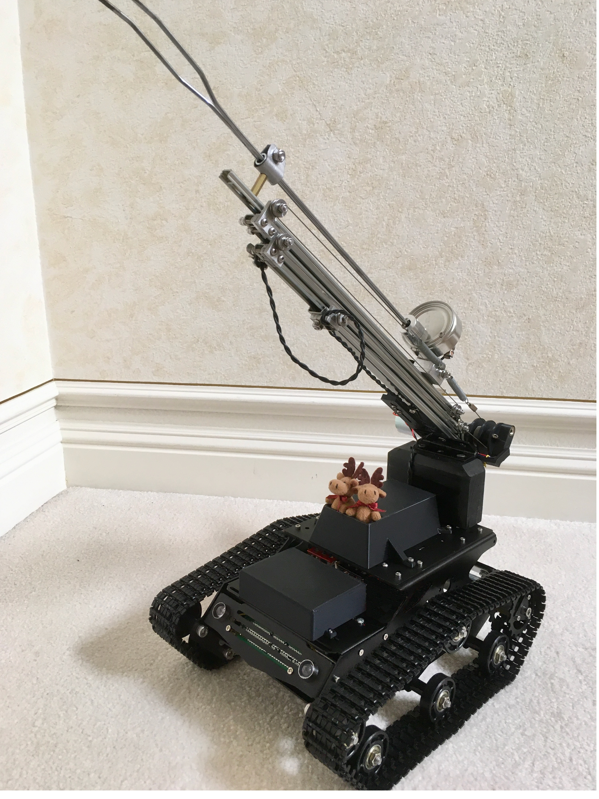
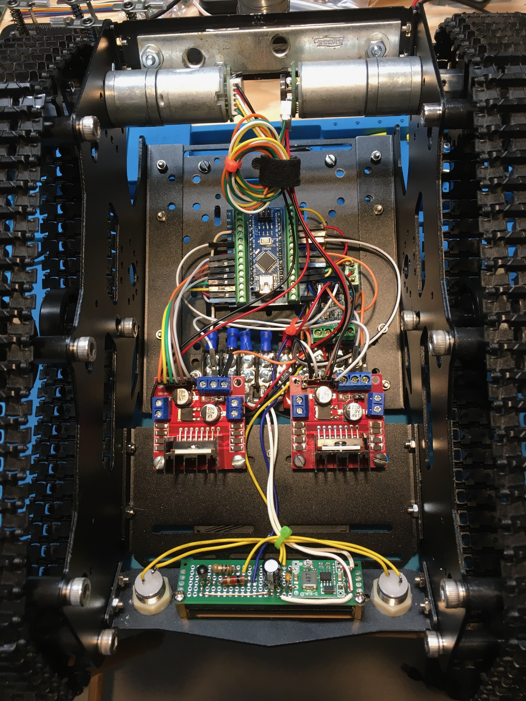

### marshmallowRoastingBot
* Arduino Nano based code for controlling a marshmallow roasting tank platform
* Controlled with homebrewed Arduino/NRF24L01 transmitter
* All metal roasting arm for reaching into campfile without (hopefully) melting...
* Roasting arm has elevation and extend/retract control
* Rotisseire motor for evenly roasted marshmallow!
* Headlights on the tank to illuminate the prize
* Track-layer tank platform for rolling over rough campground terrain

dlf  12/12/2024

### Schematics

### Build Pictures

